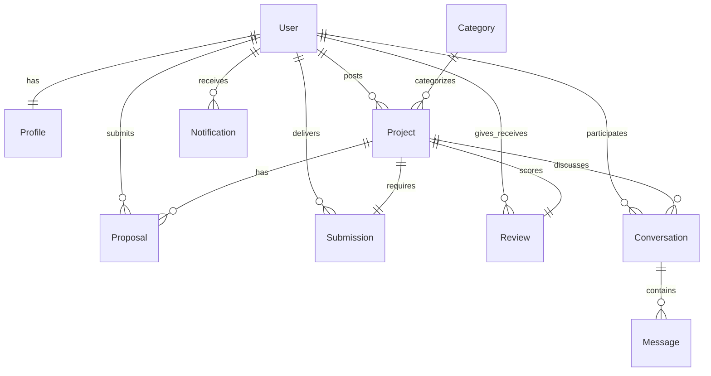

# FreelanceHub 🚀

[](https://www.djangoproject.com/)
[](https://www.python.org/)
[](https://www.postgresql.org/)
[](https://cloudinary.com/)
[](https://getbootstrap.com/)
[](https://render.com/)

A modern, full-stack Freelance Marketplace Platform designed to bridge the gap between Clients and Freelancers. Built using a robust Django backend, relational database design, asynchronous notifications, media cloud storage, and responsive Bootstrap styling, **FreelanceHub** implements real-world features like bids, submissions, reviews, messaging, and multi-parameter search filters.

---

## 🌟 Live Demo & Deployment
*   **Live Application URL:** [https://freelancehub-c8io.onrender.com](https://freelancehub-c8io.onrender.com)
*   **Hosting Platform:** Render (Web Service + Managed PostgreSQL Database)
*   **Media Assets:** Cloudinary Cloud Storage

---

## 🛠️ Tech Stack & Key Integrations

| Layer | Technology / Package | Purpose |
| :--- | :--- | :--- |
| **Backend Framework** | [Django](file:///d:/FreelanceHub/FreelanceHub/FreelanceHub/settings.py) (v5.2) | Core MVC application logic, security, ORM, and admin panel |
| **Database** | PostgreSQL | Production-grade relational storage |
| **Media Storage** | Cloudinary & `django-cloudinary-storage` | Seamless image and submission file upload to the cloud |
| **Styling & UI** | Bootstrap 5, Custom CSS & JS | Clean, responsive, mobile-first design with interactive elements |
| **User/Geo Fields** | `django-countries` | Geolocation filtering and accurate country fields |
| **Auth & Security** | Django Custom User Model & Email Verification | Role-based permission controls and SMTP-driven auth checks |

---

## 💎 Feature Highlights

### 👤 User Authentication & Profiles
*   **Custom User Model:** Differentiates system behavior based on roles (Client vs Freelancer).
*   **Email Verification:** Integrates with SMTP (Gmail API) to verify user legitimacy upon registration.
*   **Dynamic Profiles:** Displays bio, profile photo, dynamic list of skills, geographic info (city, country), and past review history.

### 💼 Project Marketplace (Client & Freelancer Flows)
*   **For Clients:**
    *   Post detailed projects with custom budgets, deadlines, and categories.
    *   Full CRUD capabilities on owned projects ([projects/views.py](file:///d:/FreelanceHub/FreelanceHub/projects/views.py)).
    *   Review, accept, or reject bids via the Client Dashboard.
    *   Review submissions, close projects, and rate the freelancer.
*   **For Freelancers:**
    *   Browse open projects, search by title, and filter dynamically by category or budget sorting ([django-filter]).
    *   Submit detailed proposals specifying cover letters and custom bid amounts.
    *   Work on accepted projects, upload deliverables/files securely, and receive ratings to build developer reputation.

### 💬 Messaging & Real-Time Alerts
*   **In-App Messaging:** Project-contextual chat channel enabling negotiations between clients and freelancers.
*   **Smart Notifications:** Triggers notifications for incoming proposals, status updates, or new messages. Includes read status tracking.

---

## 📐 Database Architecture

Below is the database relationship model designed for **FreelanceHub**:



---

## 📂 Project Structure

```
FreelanceHub/
│
├── accounts/           # User Registration, Authentication & Role Management
├── profiles/           # Freelancer/Client profile, Bio, Skills & Reviews
├── projects/           # Project CRUD, Marketplace browsing, search, and filtering
├── proposals/          # Proposal/Bid management workflow
├── submissions/        # Delivery submission interface and file upload
├── reviews/            # Feedback, rating metrics & reputation builder
├── messaging/          # Multi-party messaging / negotiation system
├── notifications/      # Real-time project activity alerts
├── categories/         # Project taxonomy and tagging system
├── core/               # Shared views, layouts, and baseline pages
├── templates/          # Global HTML templates and UI components
└── FreelanceHub/       # Global settings, routing, and deployment configurations
```

---

## 🚀 Local Installation & Setup

Follow these steps to set up the development environment locally:

### 1. Clone the Repository
```bash
git clone https://github.com/shazzad08/FreelanceHub.git
cd FreelanceHub
```

### 2. Set Up a Virtual Environment
```bash
python -m venv venv
# On Windows:
venv\Scripts\activate
# On macOS/Linux:
source venv/bin/activate
```

### 3. Install Dependencies
```bash
pip install -r requirements.txt
```

### 4. Configure Environment Variables
Create a `.env` file in the root directory and populate it with:
```env
DEBUG=True
SECRET_KEY=your_django_secret_key
CLOUDINARY_CLOUD_NAME=your_cloudinary_name
CLOUDINARY_API_KEY=your_api_key
CLOUDINARY_API_SECRET=your_api_secret
EMAIL_HOST_USER=your_email@gmail.com
EMAIL_HOST_PASSWORD=your_app_password
```

### 5. Run Database Migrations & Seed Data
```bash
python manage.py migrate
# Optional: Load initial category/sample data if available
python manage.py loaddata data.json
```

### 6. Start the Development Server
```bash
python manage.py runserver
```
Visit the application at `http://127.0.0.1:8000/`.

---

## 📈 Future Enhancements
*   **Escrow Payment Gateway:** Integration with Stripe or PayPal for secure milestone payments.
*   **Live WebSockets Chat:** Real-time push messages via Django Channels instead of polling.
*   **Advanced AI Matching:** Skill-based recommendation engine matching freelancers to suitable projects.


